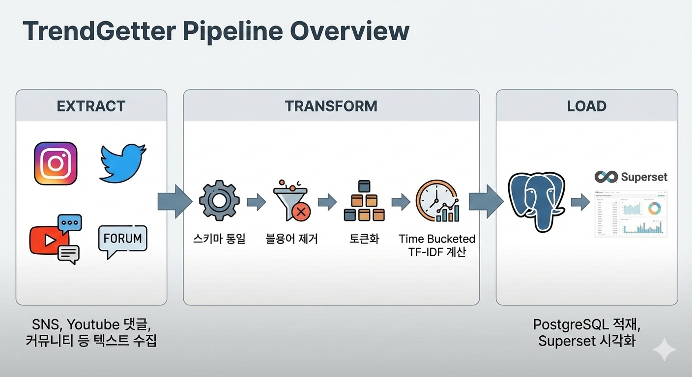

# TrendGetter
TrendSetter들이 만드는 데이터를 수집하는 프로그램. TrendGetter


*그림 0: SNS들이 던지는 데이터 받는 거미팔 포수*

TrendGetter는 3가지 부분으로 나뉩니다.

- Extract: 각종 SNS 웹페이지, Youtube 댓글, 커뮤니티 댓글 등등의 대중이 만드는 텍스트 정보 수집

- Transform: 각 데이터들을 통일된 스키마로 라벨링 및 데이터 품질 검사, Time-Windowed Temporal TF-IDF 스코어 계산.

- Load: Kibana를 활용해 데이터 시각화 구현. 이를 위해 Elasticsearch에 데이터 적재.



*그림 1: 파이프라인 개요*

## 왜 이런 식으로 만들었나요?

- **데이터 파이프라인 운용 중 일부 데이터에서 오류가 터져서 재실행해야 하는데 일일이 로그보고 수동으로 재시작하는 것이 어렵다..**
  - Airflow를 사용해서 오류 Retry를 쉽게 수행해보자!

## 이거 어떻게 사용하는 거에요?

### 과정 1: Airflow Webserver를 이용한 Dag 실행


## 그래서 의도한 대로 성과가 나왔나요?

1. **파이프라인 재시도 시간**
    - **Without Airflow vs With Airflow **: 전자(약 ??분)을 후자(약 ??분)로 단축
    - 로그확인 및 재시작 등 모든 과정이 자동화됨

## 프로젝트 구조
```
trendgetter/
├── example.py
└── scripts/
```