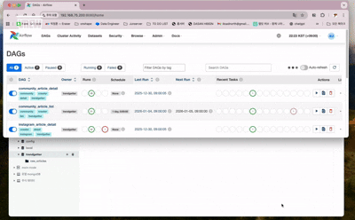

# TrendGetter
TrendSetter들이 만드는 데이터를 수집하는 프로그램. TrendGetter


*그림 0: 데이터들로 퍼즐을 맞추는 거미팔 연구원*

TrendGetter는 3가지 부분으로 나뉩니다.

- Extract: 각종 SNS 웹페이지, Youtube 댓글, 커뮤니티 댓글 등등의 대중이 만드는 텍스트 정보 수집

- Transform: 각 데이터들의 스키마 통일 및 불용어 제거, 토큰화, Time Bucketed TF-IDF 스코어 계산.

- Load: Superset 활용해 데이터 시각화 구현. 이를 위해 PostgreSQL에 데이터 적재.


*그림 1: 파이프라인 개요*

## 왜 이런 식으로 만들었나요?

- **토크나이저 로직 변경, 데이터 Html 태그 제거 등의 이유로 로직이 빈번하게 변경돼서 기존에 계산한 데이터가 쓸모없어지네..**
    - Task들을 실행일자 기준으로 **멱등성을 확보**하여 부담없이 Backfill 수행
- **크롤링을 위해 Selenium, 프로비저닝을 위해 Terraform 등을 Airflow 이미지에 포함시키니 이미지 크기가 과하게 커지네..**
    - 각각 Pan, Hermes라는 헬퍼 API 서버로 분리해 **이미지 크기를 대폭 감소**시킴
- **크롤링 Task 크기가 너무 넓게 정의되어 있다보니, 많은 시간을 들여 Retry를 수행해야 하네..**
    - 크롤링 Task를 역할마다 잘게 쪼개서 **Retry 범위를 좁힘**
- **전통적인 스코어들 중에 트렌드 키워드를 정의할 만한 기준이 존재하지 않네..**
    - 기존 TF-IDF의 정의를 응용해 시간 의존적인 **TF-IDF 스코어를 새롭게 정의**

## 이거 어떻게 사용하는 거에요?

### 과정 1: xxx_article_list Dag들에 의해 텍스트 데이터 적재


### 과정 2: tokenization Dag들에 의해 불용어 제거 및 토큰 데이터 적재




### 과정 3: token_aggregation Dag들에 의해 스코어 계산 및 적재


### 과정 4: token_aggregation Dag들에 의해 PostgreSQL로 데이터 이관


### 과정 5: Superset를 활용해 데이터 시각화


## 그래서 의도한 대로 성과가 나왔나요?

1. **파이프라인 재시도 시간**
    - 로그확인 및 재시작 등 모든 과정이 자동화됨
    - 로그 수집 툴[ex) ELK, Prometheus, Datadog]를 도입하지 않아도 됨.

2. **Backfill 수행 속도 향상**
    - 실행시간 기준으로 backfill을 수행하는 명령어를 Airflow 차원에서 제공함.

## 프로젝트 구조
```
trendgetter/
├── dags/                     # Airflow DAG 정의 파일들
│   ├── community_crawling_dag.py
│   ├── instagram_crawling_dag.py
│   ├── tfidf_dag.py
│   ├── tokenization_dag.py
│   └── youtube_crawling_dag.py
├── deploy/                   # Kubernetes 배포 설정 파일들
│   ├── airflow-scheduler.yaml
│   ├── airflow-webserver.yaml
│   ├── airflow-worker.yaml
│   ├── apply.sh
│   ├── backfill.sh
│   ├── commit_pg_schema.sh
│   ├── mongodb.yaml
│   ├── postgres.yaml
│   ├── redis.yaml
│   ├── superset.yaml
│   └── ...
├── src/                      # 소스 코드
│   ├── alembic/              # Alembic 마이그레이션 파일들
│   ├── api_client.py
│   ├── crawler.py
│   ├── model.py
│   ├── mongodb.py
│   ├── postgresql.py
│   ├── quality_assurance.py
│   ├── statistics.py
│   └── utils.py
├── plugins/                  # Airflow 플러그인
├── Dockerfile                # Airflow 이미지 빌드 파일
├── pyproject.toml            # 프로젝트 의존성 및 설정
└── main.py
```